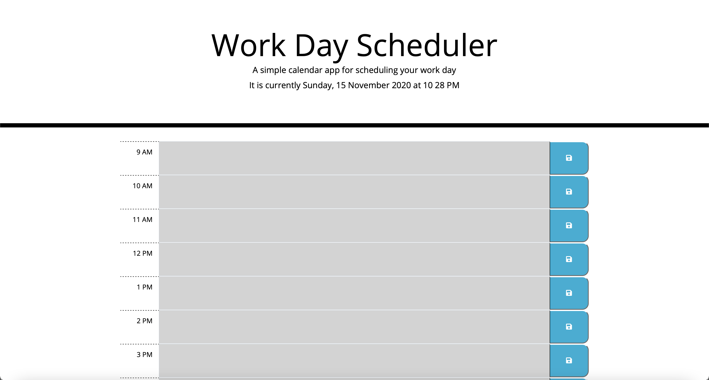

# 5-Third-Party-APIs-Challenge
## Word Day Scheduler

## Contents
1. [Desceription](#description)
2. [User Story](#user-story)
3. [Acceptance Criteria](#acceptance-criteria)
4. [Installation](#installation)
5. [Screenshot](#screenshot)
6. [Website](#website)
7. [Contribution](#contribution)
8. [Built With](#built-with)

## Description
Create a simple calendar application that allows a user to save events for each hour of the workday. This app will run in the browser and feature dynamically updated HTML and CSS powered by jQuery.

### User Story
>AS AN employee with a busy schedule  
>I WANT to add important events to a daily planner 
>SO THAT I can manage my time effectively 
 

## Acceptance Criteria
>GIVEN I am using a daily planner to create a schedule 
>WHEN I open the planner 
>THEN the current day is displayed at the top of the calendar 
>WHEN I scroll down 
>THEN I am presented with time blocks for standard business hours 
>WHEN I view the time blocks for that day 
>THEN each time block is color-coded to indicate whether it is in the past, present, or future 
>WHEN I click into a time block 
>THEN I can enter an event 
>WHEN I click the save button for that time block 
>THEN the text for that event is saved in local storage 
>WHEN I refresh the page 
>THEN the saved events persist 

## Installation
An application that will run in the browser and feature dynamically updated HTML and CSS powered by JQuery. Application features polished UI and is responsive, ensuring adaptation to multiple screen sizes.

## Screenshot

 

## Website
[Deployment Website](https://jorgeebn16.github.io/taskinator-pro/)

## Contribution
Made with ❤️ by Jorge Navarro

## Built With
* [HTML5](https://developer.mozilla.org/en-US/docs/Web/Guide/HTML/HTML5)
* [CSS](https://developer.mozilla.org/en-US/docs/Web/CSS)
* [Javascript](https://developer.mozilla.org/en-US/docs/Web/JavaScript)
* [jQuery](https://jquery.com/)
* [Font Awesome](https://fontawesome.com/)
* [Bootstrap](https://getbootstrap.com/)
* [Google Fonts](https://fonts.google.com/)